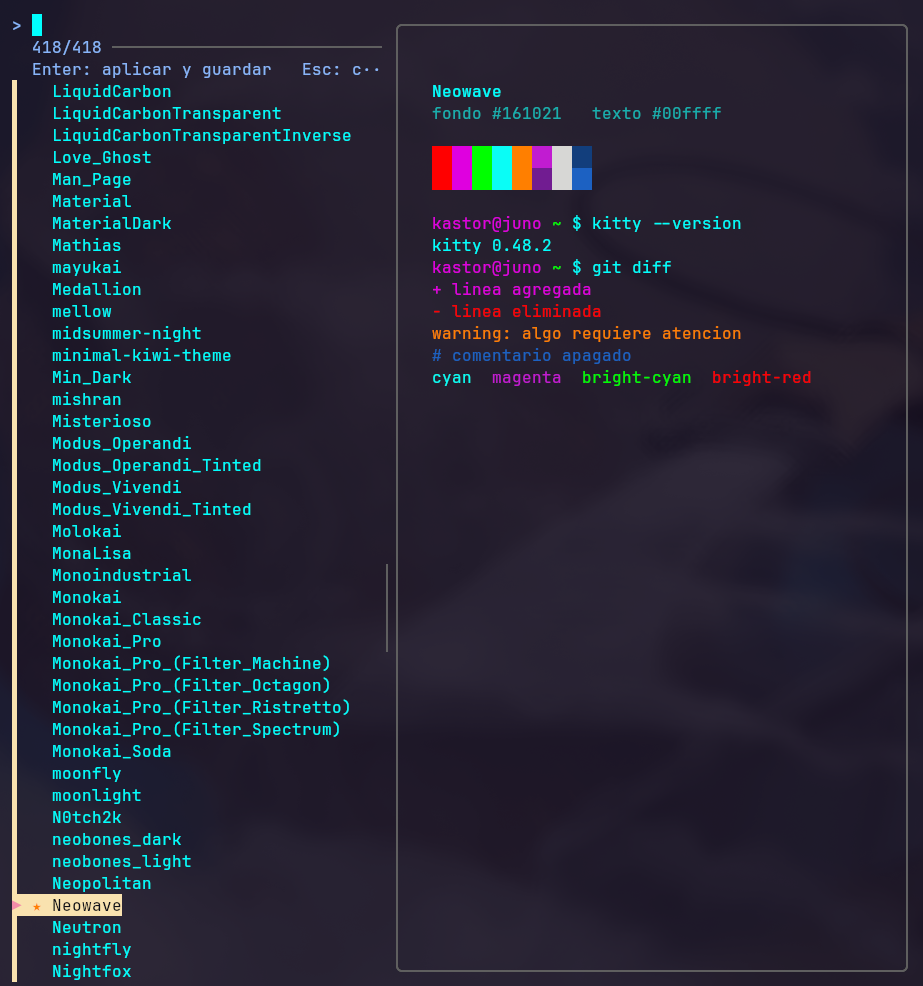

# kitty-theme-picker

<p align="center">
  
</p>

Selector interactivo de temas para el emulador de terminal Kitty con vista previa en vivo.

## Descripcion

`kitty-theme-picker` es un script en Bash que presenta un selector basado en `fzf` con todos los esquemas de colores disponibles localmente para Kitty. Mientras se navega por la lista, cada tema se aplica en tiempo real sobre la instancia activa del terminal mediante el protocolo de control remoto de Kitty, sin abrir ventanas auxiliares ni procesos residentes. Al confirmar, el tema elegido queda persistido; al cancelar, los colores previos se restauran con precision.

El script esta pensado para ser autocontenido y portable: verifica sus dependencias al arrancar, completa el catalogo de temas automaticamente si es necesario y no requiere conexion durante el uso normal.

## Caracteristicas

- Vista previa en vivo: los colores se aplican instantaneamente al terminal activo en cada movimiento del cursor.
- Posicion inicial sobre el tema ya activo, detectado por checksum de contenido y no por nombre de archivo.
- Bootstrap automatico del catalogo: si hay menos de 400 temas locales, descarga las colecciones `dexpota/kitty-themes` y la oficial `kovidgoyal/kitty-themes`; los archivos existentes nunca se sobrescriben.
- Verificacion de dependencias al arranque con mensajes de error explicitos: `bash >= 4`, `fzf` (0.28 o superior recomendado), `kitty`, `awk`, `sort` y `cksum`.
- Cancelacion segura: toma una instantanea IPC antes de iniciar y la restituye ante `Esc` o `Ctrl-C`.
- Rutas calientes optimizadas: construccion de lista sin forks, deteccion del tema activo en una sola pasada de checksum, socket de IPC cacheado y snapshot limitado a las claves que el selector modifica.

## Requisitos

- Kitty con `allow_remote_control socket-only` y `listen_on unix:/tmp/kitty-theme-sync` en `kitty.conf`.
- `fzf` (0.28+ para posicion inicial), `awk`, `sort`, `cksum`.
- `curl` o `wget` unicamente para la descarga automatica del catalogo.

## Instalacion rapida

Una sola linea para descargar e instalar el script, el catalogo de temas y validar el entorno:

```bash
curl -fsSL https://raw.githubusercontent.com/kastormdz/kitty-theme-picker/main/kitty-theme-picker.sh | bash
```

El script detecta automaticamente que se ejecuta por `stdin`, se descarga desde GitHub a `~/.local/bin/kitty-theme-picker.sh`, completa el catalogo de temas si hace falta y reporta el estado de las dependencias y de la configuracion de IPC de Kitty.

## Instalacion desde el repositorio

Clonar el repositorio y ejecutar el instalador incluido:

```bash
./kitty-theme-picker.sh install
```

El comando `install` realiza lo siguiente:

- Copia el script a `~/.local/bin` con permisos de ejecucion. Si ya existe un enlace simbolico apuntando a este repositorio, lo respeta en lugar de reemplazarlo.
- Verifica que `~/.local/bin` figure en el `PATH` y advierte si no es asi.
- Comprueba las dependencias (`fzf`, `kitty`, `awk`, `sort`, `cksum`, `tar`, `curl` o `wget`) y reporta las faltantes.
- Completa el catalogo de temas si esta por debajo del umbral, igual que en el arranque normal.
- Valida que `kitty.conf` contenga las dos lineas de IPC necesarias para el preview en vivo e indica como agregarlas si faltan.

Es idempotente: puede ejecutarse cuantas veces se desee sin efectos secundarios.

Alternativamente, la instalacion manual sigue siendo valida:

```bash
mkdir -p ~/.local/bin
ln -sf "$(pwd)/kitty-theme-picker.sh" ~/.local/bin/kitty-theme-picker.sh
```

Asegurarse de que `~/.local/bin` este en el `PATH`.

## Actualizacion del catalogo

```bash
kitty-theme-picker.sh refresh
```

Re-descarga ambas colecciones y suma unicamente los temas nuevos publicados upstream; los archivos existentes, incluidos los personalizados, nunca se sobrescriben. No requiere una instancia de Kitty abierta ni conexion IPC.

## Uso

Ejecutar `kitty-theme-picker` dentro de cualquier ventana de Kitty. Navegar con las flechas para previsualizar temas en vivo. `Enter` aplica y guarda la seleccion en `current-theme.conf`; `Esc` restaura los colores anteriores sin guardar cambios.

## Notas tecnicas

El selector escribe unicamente en `current-theme.conf` dentro del directorio de configuracion de Kitty. Herramientas externas que regeneren ese archivo pueden pisar la seleccion almacenada. La aplicacion en vivo usa `kitty @ set-colors` sobre el socket configurado en `listen_on`; si hay multiples instancias de Kitty, se utiliza el socket mas reciente.
